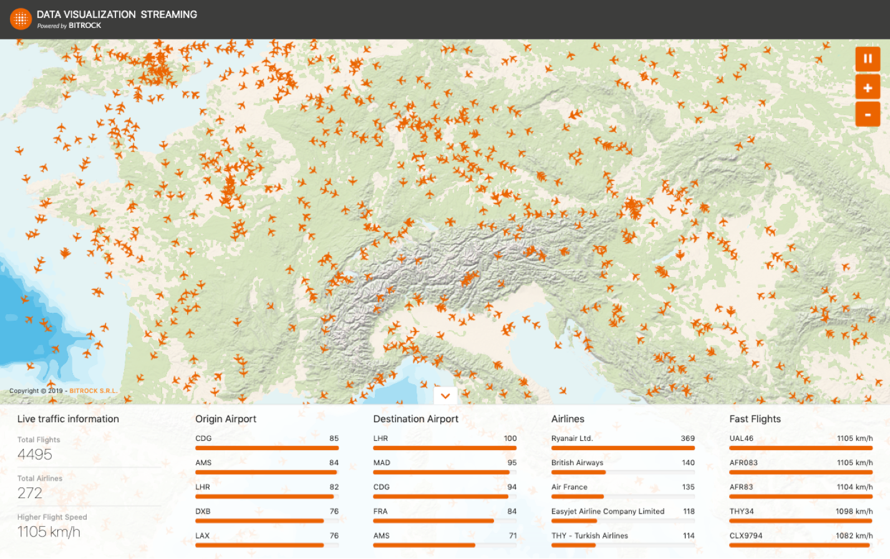

# K·FlightStream UI
[](https://iproject-jenkins.reactive-labs.io/view/Kafka%20Geostream/job/kafka-geostream-ui/job/master/)


[PWA](https://developers.google.com/web/progressive-web-apps/) built in [Vue.js](https://vuejs.org/) for the [K·FlightStream project](https://github.com/search?q=topic%3Akafka-geostream+org%3Abitrockteam&type=Repositories). It's a realtime dashboard that visualize the flights activities. The data is processed through a backend developed in Scala with Kafka Streams & KSQL.

[https://geostream.bitrock.it](https://geostream.bitrock.it)

## Screenshot


## Demo mode
You can append the query parameter `?demo=[NUMBER-OF-MINUTES]` to the url to enable the demo mode, once activated it will fully refresh the application every specified minutes.

For example, this will refresh the application every 30 minutes:

```
http://geostream.bitrock.it/?demo=30
```

This is useful if you want to run the application for an indefinite amount of time, like in a kiosk or totem device.

## Design
The UI & UX of the application is designed on top of the [Amber Design System](https://amber.bitrock.it/) made by Bitrock. Loading states are handled using an "[Optmistic UI](https://uxplanet.org/optimistic-1000-34d9eefe4c05)" updates pattern.

To prevent an overhead of visible informations for the user, the map shows the latest 100 RSVP events, without interrupting the data stream flow happening in the background and in other widgets.

## Development

### What is being used?
* [Typescript](https://www.typescriptlang.org/)
* [Vue](https://vuejs.org/) (CLI, Router, Vuex)
* [RxJS](https://rxjs.dev/)
* [SASS](https://sass-lang.com/)
* [Amber Design System](https://amber.bitrock.it/)
* [Mapbox](https://www.mapbox.com/)

### Getting started
Clone the repo
```bash
$ git clone git@github.com:bitrockteam/kafka-geostream-ui.git
$ cd kafka-geostream-ui
```

Install dependencies
```bash
$ yarn
--- or ---
$ npm install
```

### Available NPM tasks
Start the project in development mode (live reload)
```bash
$ yarn start
--- or ---
$ npm start
```

Create a static build in the `./dist` folder
```bash
$ yarn build
--- or ---
$ npm run build
```

Run the unit tests (*only plain Typescript files via Jest*)
```bash
$ yarn test:unit
--- or ---
$ npm run test:unit
```

### Change REST & websocket endpoints URL
The project make use of `.env` files, just update the values before starting the local server or building.

### Things to keep in mind
* The Vuex store contains **only** global values for the application, the real time data coming from the websockets is processed & rendered directly in the relative component state. Otherwise the store would act as a computational bottleneck.
* Each widget in the dashboard is **independent** on getting the data from the backend and is also exported as dedicated module for lazy loading. Both of these approaches also results in a better development experience.
* For a cleaner UX, the map will show only **the latest 100 RSVP events**. The amount of markers for the "time window" is defined in the Vuex store.

## How to contribute
Pull Request Submitting Process:
1. branch from `master` using a `feature/[name]` or `fix/[name]` naming
2. write code
3. bump the version number in the `package.json` file accordingly to the [semver](https://semver.org/) guidelines
4. check that linter & tests are fine
5. open a PR to `master` assigning as a reviewer someone from [UI Engineering team](https://github.com/orgs/bitrockteam/teams/ui-engineering/members)
6. wait for response
7. if it's approved, merge and delete the feature branch

Please refer to the [contributing.md](contributing.md) file for the full guidelines and code of conduct.

<!-- ## Next steps
* Development environment & branch
* settings page/modal (activate demo mode & set event window from UI)
* code highlightning in the KSQL queries related to the widgets
* time travel events (with backend support) -->

## License
Application developed by Bitrock UI Engineering team, released under the [MIT license](LICENSE).

[Bitrock](https://bitrock.it/) s.r.l is part of [Databiz Group](https://databiz.it/).
